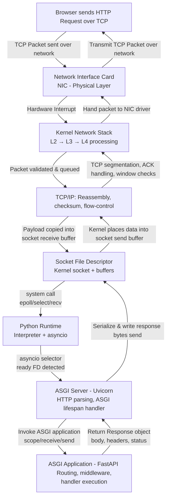
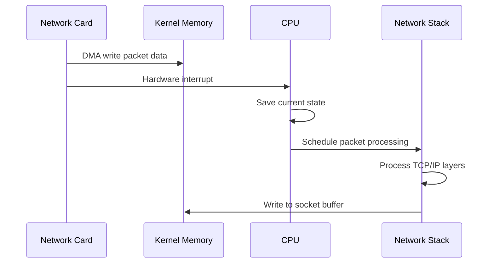
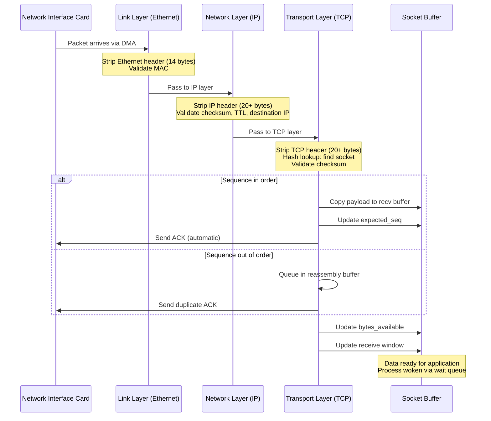
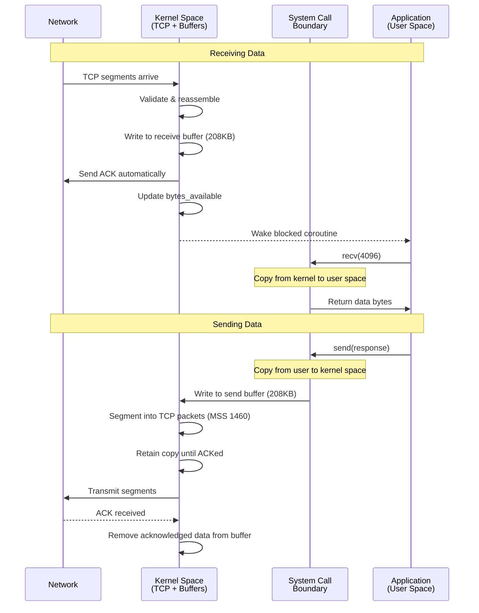
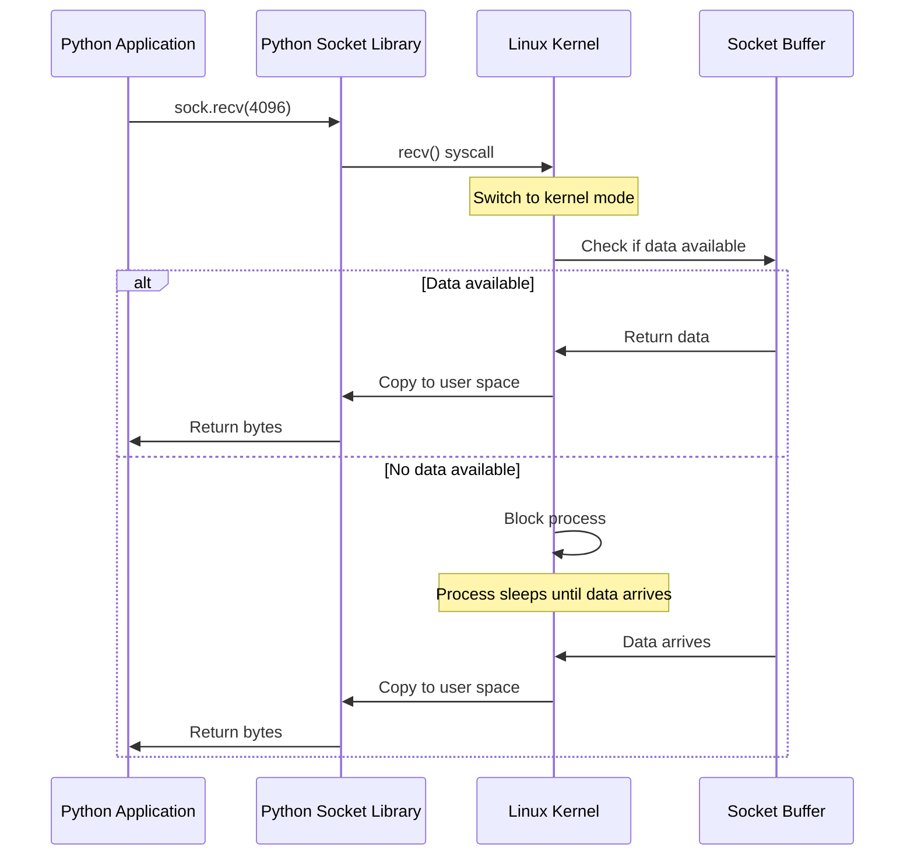

When you type a URL into your browser and hit enter, an extraordinary journey begins. Within milliseconds, your request traverses network cables, gets processed by operating system kernels, flows through Python runtimes, and eventually produces the response you see on screen. This journey is so fast and seamless that we rarely stop to think about the complex choreography happening beneath the surface.

This two-part series traces the complete journey of an HTTP request in Python's ASGI ecosystem. **Part 1** focuses on the operating system layer, how packets arrive at your network card, flow through the kernel's TCP/IP stack and land in socket buffers. [**Part 2**](/posts/python-http-journey-part-2) will explore the application layer, how Python's `asyncio` event loop, ASGI servers like Uvicorn and your web framework collaborate to turn those bytes into responses.

By the end of this series, you'll understand exactly what happens when someone makes a request to your FastAPI application, and why ASGI is designed the way it is. 

Let's begin at the lowest level, where photons become [packets](https://en.wikipedia.org/wiki/Network_packet), and hardware becomes software.

## The Big Picture

Before we dive into details, let's visualize the complete journey from a high level:




This diagram shows the complete path, but it barely scratches the surface. Let's explore each layer in detail.

## 1. The Kernel Receives Data

### Network Interface and Interrupts

When data arrives at your server, the first component to know about it isn't your Python application or even the operating system's high-level network code. It's the [Network Interface Card (NIC)](https://en.wikipedia.org/wiki/Network_interface_controller) hardware itself.

Here's what happens:

1. **Packet Arrival**: The NIC receives electrical signals (or light pulses for fiber) representing your HTTP request
2. **DMA Transfer**: The NIC uses [Direct Memory Access](https://en.wikipedia.org/wiki/Direct_memory_access) to write the packet data directly into a pre-allocated kernel memory buffer
3. **Hardware Interrupt**: The NIC triggers a [hardware interrupt](https://en.wikipedia.org/wiki/Interrupt#Hardware_interrupts) to notify the CPU that data has arrived
4. **Interrupt Handler**: The kernel's [interrupt handler](https://en.wikipedia.org/wiki/Interrupt_handler) is invoked, which schedules the network stack to process this data

This all happens in microseconds, and it's happening for potentially thousands of packets per second on a busy server.



### TCP/IP Stack Processing

Once the interrupt handler schedules packet processing, the kernel's network stack processes the packet through multiple protocol layers. This happens entirely in kernel space.

1. **Ethernet Layer**: Strips off the Ethernet frame, validates the destination MAC address
2. **IP Layer**: Validates IP header, checks destination IP, handles fragmentation if needed
3. [**TCP Layer**](https://en.wikipedia.org/wiki/Transmission_Control_Protocol): This is where the real work happens. The kernel:
   - Validates checksum: Ensures data integrity
   - Looks up connection: Uses (src_ip, src_port, dst_ip, dst_port) to find the socket
   - Checks sequence numbers: Handles out-of-order packets and duplicates
   - Updates state machine: Manages TCP states (ESTABLISHED, FIN_WAIT, etc.)
   - Performs flow control: Adjusts receive window based on buffer availability
   - Sends ACK: Acknowledges received data automatically
4. **Delivering to the [socket](https://en.wikipedia.org/wiki/Berkeley_sockets):** Once the kernel identifies the destination socket, it:
   - Copies payload data into the socket's receive buffer
   - Updates buffer pointers and available byte count
   - Wakes any process/coroutine waiting on this socket (via the wait queue)

Let's visualize the journey:



The entire journey from NIC interrupt to socket buffer typically takes 10-100 microseconds on modern hardware. This processing happens for every single packet, which is why kernel optimization is crucial for high-performance networking.

### Socket Buffers: The Kernel-Userspace Bridge

Once the kernel identifies which socket the packet belongs to using the connection's four-tuple `source IP:port, dest IP:port`, it writes the data into that socket's **receive buffer**, a ring buffer allocated in kernel memory. This buffer is the critical interface between kernel space and user space.

Each socket maintains two buffers:

```c
// Kernel maintains these internally (simplified representation)
struct socket_buffers {
    char recv_buffer[SO_RCVBUF];  // Default: 208KB on Linux
    char send_buffer[SO_SNDBUF];  // Default: 208KB on Linux
    size_t recv_bytes_available;
    size_t send_bytes_used;
    wait_queue_head_t wait_queue; // Processes waiting on this socket
};
```

When TCP segments arrive, the kernel:
1. **Validates** sequence numbers and checksums
2. **Reassembles** out-of-order segments using sequence numbers
3. **Writes** data to the receive buffer
4. **Sends ACK** back to sender (automatic)
5. **Wakes** any process/coroutine blocked on this socket

The receive buffer size determines TCP's **receive window**—how much unacknowledged data the sender can transmit. If your application doesn't read fast enough and the buffer fills, the kernel advertises a zero window, throttling the sender.

For sending, when you call `send()`, data is copied from user space to the kernel's send buffer. The kernel then:
1. **Segments** data into TCP packets (Maximum Segment Size typically 1460 bytes)
2. **Transmits** segments with sequence numbers
3. **Retains** copies until ACKed (for potential retransmission)
4. **Removes** acknowledged data from buffer

You can inspect and tune buffer sizes:

```python
import socket

sock = socket.socket()
# Check current sizes
recv_buf = sock.getsockopt(socket.SOL_SOCKET, socket.SO_RCVBUF)
send_buf = sock.getsockopt(socket.SOL_SOCKET, socket.SO_SNDBUF)

# Increase for high-bandwidth connections
sock.setsockopt(socket.SOL_SOCKET, socket.SO_RCVBUF, 1048576)  # 1MB
sock.setsockopt(socket.SOL_SOCKET, socket.SO_SNDBUF, 1048576)
```

These buffers decouple application read/write speed from network speed, enabling efficient pipelining and flow-control essential for TCP's reliability guarantees. Let's take a look at the full picture:




## 2. System Calls and File Descriptors

### The Socket File Descriptor

In Unix-like systems, the philosophy is ["everything is a file"](https://en.wikipedia.org/wiki/Everything_is_a_file), including [network sockets](https://en.wikipedia.org/wiki/Network_socket). When your application creates a socket, the kernel returns a [**file descriptor**](https://en.wikipedia.org/wiki/File_descriptor): a small non-negative integer that serves as an index into the process's file descriptor table.

```python
import socket

sock = socket.socket(socket.AF_INET, socket.SOCK_STREAM)
fd = sock.fileno()  # Returns an integer like 3, 4, 5, etc.
print(f"Socket file descriptor: {fd}")
```

**What the file descriptor represents:**

The kernel maintains a per-process table mapping file descriptors to kernel data structures. For sockets, this points to a `struct socket` containing:
- Socket buffers (send/receive)
- Connection state (ESTABLISHED, CLOSE_WAIT, etc.)
- Peer address (IP:port)
- Protocol-specific data (TCP sequence numbers, window size)
- File operations table (read, write, close functions)

**Why file descriptors matter:**

Every socket operation requires passing this file descriptor to the kernel:

```python
import os

# All these operations use the file descriptor internally
data = sock.recv(4096)        # → recv(fd, buffer, 4096)
sock.send(b"data")            # → send(fd, "data", 4)
sock.close()                  # → close(fd)

# You can even use low-level os functions
os.read(fd, 4096)             # Works! Treats socket like a file
os.write(fd, b"data")         # Also works!
```

**File descriptor limits:**

Each process has limits on open file descriptors (typically 1024 by default, configurable up to system limits). This matters for servers handling thousands of connections:

```bash
# Check current limits
ulimit -n  # Soft limit: 1024

# Increase for production servers
ulimit -n 65536
```

When you run out of file descriptors, `accept()` fails with "Too many open files", a common production issue. ASGI servers handle this by configuring appropriate limits and connection pooling.

### System Calls: Crossing the Boundary

[System calls](https://en.wikipedia.org/wiki/System_call) are the mechanism for transitioning from user space (where your Python code runs) to kernel space (where the OS manages hardware and resources). This transition is expensive compared to normal function calls. It involves context switching, privilege level changes, and potentially copying data.

**What happens during a system call:**

```python
import socket

sock = socket.socket(socket.AF_INET, socket.SOCK_STREAM)
```

This innocent-looking Python call triggers:
1. Python → C library wrapper
2. C library → software interrupt (syscall instruction)
3. CPU switches to kernel mode
4. Kernel validates parameters, performs operation
5. CPU switches back to user mode
6. Return value propagated back to Python

Here are the key system calls involved in our HTTP request journey:

```python
import socket

# socket() - Create socket structure in kernel
sock = socket.socket(socket.AF_INET, socket.SOCK_STREAM)

# bind() - Associate socket with address
sock.bind(('0.0.0.0', 8000))

# listen() - Mark socket as passive, create accept queue  
sock.listen(128)

# accept() - Retrieve connection from queue (blocks if empty)
client, addr = sock.accept()

# recv() - Copy data from kernel buffer to user space
data = client.recv(4096)

# send() - Copy data from user space to kernel buffer
client.send(b"HTTP/1.1 200 OK\r\n\r\n")

# close() - Release socket resources
client.close()
```

Let's look at what happens during a `recv()` call:



### Blocking vs Non-Blocking Sockets

Traditional socket programming is **blocking**. When you call `recv()` and there's no data available, your process goes to sleep until data arrives. This is fine for simple applications, but it's disastrous for servers that need to handle thousands of concurrent connections.

```python
import socket

# Blocking socket (default)
sock = socket.socket()
sock.connect(('example.com', 80))
data = sock.recv(4096)  # This BLOCKS until data arrives
print(data)
```

To handle multiple connections, you have three main options:

1. **Multi-threading**: One thread per connection (expensive, doesn't scale to thousands)
2. **Multi-processing**: One process per connection (even more expensive)
3. **Non-blocking I/O with event loops**: Handle many connections in one thread (efficient, scalable)

ASGI is built on non-blocking sockets and uses an [event loop](https://en.wikipedia.org/wiki/Event_loop) to efficiently multiplex between many connections.

```python
import socket
import select

# Non-blocking socket
sock = socket.socket()
sock.setblocking(False)  # This is the key!

try:
    sock.connect(('example.com', 80))
except BlockingIOError:
    pass  # Connect is in progress

# Use select/epoll to wait for socket to be ready
select.select([sock], [sock], [], 5.0)
# Now socket is ready for I/O
```

## Conclusion

We've journeyed from the physical layer to the kernel-userspace boundary, witnessing how an HTTP request traverses the operating system's networking stack. From the moment network packets arrive at your NIC, through hardware interrupts and DMA transfers, to TCP/IP processing and socket buffers, every step is orchestrated by the kernel with microsecond precision.

The key insights from this exploration:

- **Hardware and kernel handle the heavy lifting**: Your application never sees individual packets, TCP handshakes, or retransmissions, the kernel manages all of this automatically
- **Socket buffers are the critical interface**: These kernel-space ring buffers decouple network speed from application speed, enabling efficient flow control
- **System calls are expensive**: Every transition between user and kernel space involves context switches, which is why minimizing these calls matters for performance

At this point in our journey, data sits ready in socket receive buffers, waiting for your application to read it. The kernel has done its job ensuring reliable, ordered delivery of bytes. But how does Python efficiently monitor potentially thousands of these sockets without blocking? How does a single thread handle concurrent connections?

In [**Part 2**,](/posts/python-http-journey-part-2) we'll explore the application layer—where asyncio's event loop, epoll multiplexing, and the ASGI protocol come together to build the scalable web applications you write every day. We'll see how Python bridges the gap between low-level socket operations and high-level framework code, making concurrent programming both powerful and elegant.
