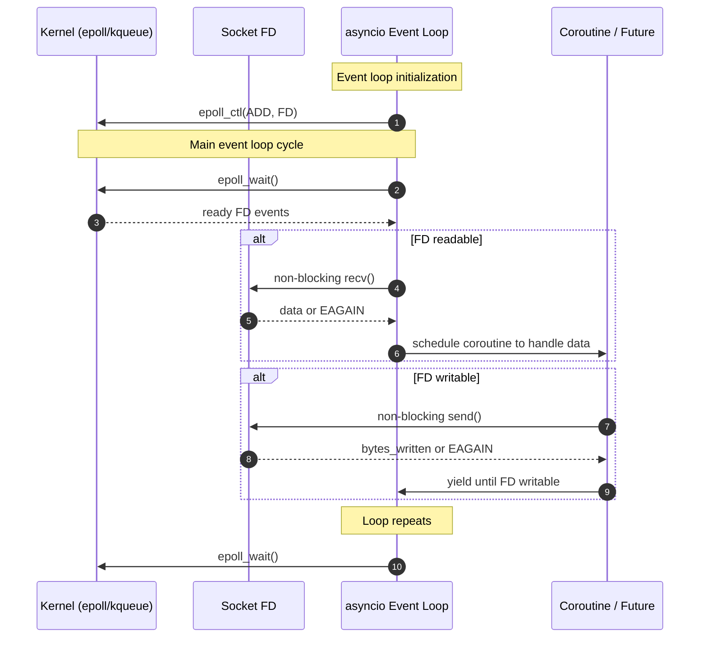
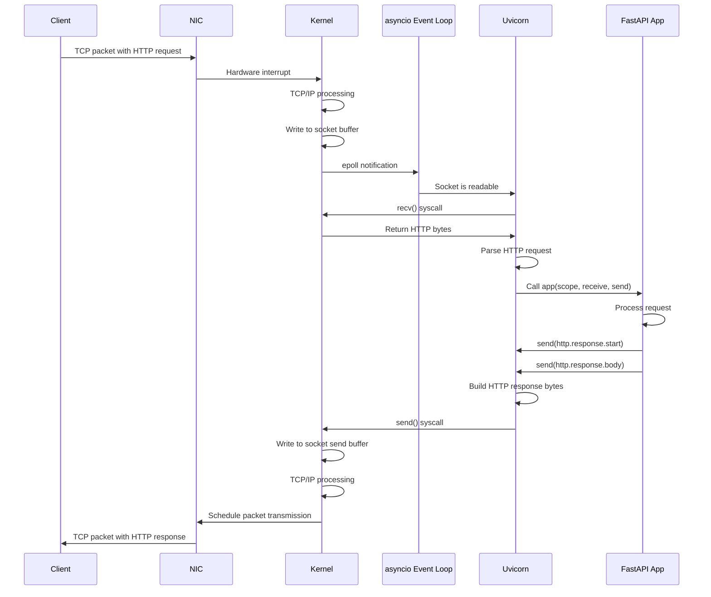
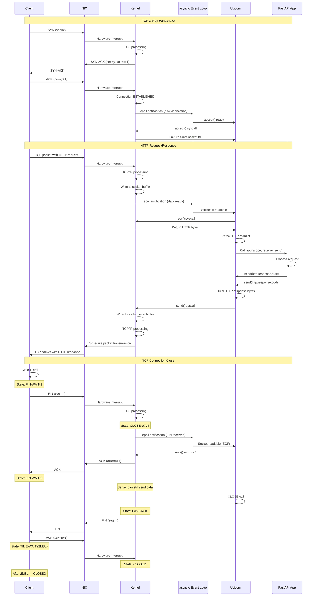

In [Part 1](/posts/python-http-journey-part-1), we followed an HTTP request from the network interface card through the kernel's TCP/IP stack to socket buffers. We saw how hardware interrupts trigger kernel processing, how TCP ensures reliability, and how socket buffers bridge kernel and user space. But our journey isn't complete. The data is sitting in kernel memory and your Python application still hasn't touched it.

**Part 2** picks up where we left off, at the boundary between the operating system and your application. We'll explore how Python's `asyncio` event loop efficiently monitors thousands of sockets using epoll, how ASGI servers like Uvicorn translate raw bytes into structured messages, and how your FastAPI application processes requests without blocking.

This is where the elegance of ASGI shines. While [Part 1](/posts/python-http-journey-part-1) showed us the raw power of the kernel handling packets at microsecond speeds, Part 2 reveals how Python leverages that power to build scalable, concurrent web applications with clean, readable code.

Let's cross the system call boundary and enter the world of async Python.

## Layer 3: The Event Loop and I/O Multiplexing

### The Problem with Blocking I/O

Imagine a web server handling 10,000 concurrent connections. With blocking I/O, you'd need 10,000 threads or processes. Each thread consumes memory (typically 1-8 MB of stack space), and context switching between thousands of threads destroys CPU cache efficiency.

The solution is **I/O multiplexing**: using a single thread to monitor many file descriptors and only processing them when they're ready.

### Enter epoll/kqueue/select

Operating systems provide system calls for efficient I/O multiplexing:

- **select**: The oldest, works on all platforms, limited to ~1024 file descriptors
- **poll**: Similar to select but no hard limit on file descriptors
- **epoll** (Linux): Highly efficient (uses a red–black tree), O(1) performance for ready events
- **kqueue** (BSD/macOS): Similar to epoll

Python's `asyncio` uses the most efficient mechanism available on your platform. On Linux, that's `epoll`.

```python
import select
import socket

# Create a listening socket
server = socket.socket()
server.setblocking(False)
server.bind(('0.0.0.0', 8000))
server.listen(128)

# Create epoll object
epoll = select.poll()
epoll.register(server.fileno(), select.POLLIN)

# Event loop
connections = {}
while True:
    # Wait for events (this is a blocking syscall, but efficient!)
    events = epoll.poll()
    
    for fd, event in events:
        if fd == server.fileno():
            # New connection
            client, addr = server.accept()
            client.setblocking(False)
            epoll.register(client.fileno(), select.POLLIN)
            connections[client.fileno()] = client
        else:
            # Data on existing connection
            client = connections[fd]
            data = client.recv(4096)
            print(data.decode())
            client.send(b"HTTP/1.1 200 OK\r\n\r\nHello")
            epoll.unregister(fd)
            client.close()
            del connections[fd]
```

This pattern register file descriptors with epoll, wait for events, handle ready sockets is the foundation of all async Python frameworks.

### Python's asyncio Event Loop

Python's `asyncio` wraps this low-level epoll/kqueue machinery in a high-level API with coroutines, tasks, and futures. Here's a simplified view of what the event loop does:



Here's what this looks like in actual asyncio code:

```python
import asyncio

async def handle_client(reader, writer):
    """Handle a single client connection"""
    # reader.read() doesn't block the thread!
    # It yields control back to the event loop
    data = await reader.read(4096)
    
    # Process request
    response = b"HTTP/1.1 200 OK\r\n\r\nHello World"
    
    # writer.write() is synchronous, but drain() waits for the write to complete
    writer.write(response)
    await writer.drain()
    
    writer.close()
    await writer.wait_closed()

async def main():
    # Start server
    server = await asyncio.start_server(
        handle_client, 
        '0.0.0.0', 
        8000
    )
    
    async with server:
        await server.serve_forever()

# Run the event loop
asyncio.run(main())
```

When `await reader.read(4096)` is called:
1. The `asyncio` event loop checks if data is available in the kernel socket buffer (`epoll_ctl`)
2. If not available, it registers interest in this socket with epoll (`epoll_wait`)
3. The coroutine is suspended, event loop continues with other tasks
4. When data arrives, kernel notifies epoll, event loop resumes the coroutine (performs `recv()`)
5. Data is read from kernel buffer to user space (via `recv()`) and returned


When `writer.write(response)` is called:
1. The asyncio event loop checks if the socket is writable (if the kernel send buffer has space)
2. If the send buffer is full, the event loop registers interest in `writable` events using `epoll_wait`.
3. The coroutine is suspended, and the event loop continues running other tasks
4. When kernel buffer becomes available, kernel notifies epoll and event loop resumes the suspended coroutine (performs `send()`)
5. Data is copied from user space into the kernel buffer (via `send()`) and returns once the write is accepted


## Layer 4: ASGI Protocol

### Why ASGI Exists

We've now covered how data gets from the network card to the Python event loop. But there's still a gap: how does the event loop pass HTTP requests to your web application (FastAPI)? This is where ASGI comes in. ASGI is a **specification**, an agreed-upon interface between web servers (like Uvicorn) and web applications (like FastAPI).

Before ASGI, we had WSGI (Web Server Gateway Interface), which worked perfectly for synchronous Python. But WSGI has a fundamental limitation: it's synchronous and blocking. Every request blocks a worker thread. ASGI solves this by defining an async interface that allows servers and applications to communicate using coroutines.

### The ASGI Interface

At its core, ASGI defines two things:

1. **Application**: A coroutine that receives events and can send events back
2. **Message format**: Standardized dictionaries for communication

Here's the signature of an ASGI application:

```python
async def application(scope, receive, send):
    """
    scope: dict - Information about the connection (HTTP or WebSocket)
    receive: coroutine - Receive messages from the server
    send: coroutine - Send messages to the server
    """
    pass
```

Let's build a simple ASGI application to see how this works:

```python
async def hello_world_app(scope, receive, send):
    """Simplest possible ASGI application"""
    
    # scope contains connection metadata
    if scope['type'] == 'http':
        # Wait for the HTTP request body (even if empty)
        await receive()
        
        # Send response start (status and headers)
        await send({
            'type': 'http.response.start',
            'status': 200,
            'headers': [
                [b'content-type', b'text/plain'],
            ],
        })
        
        # Send response body
        await send({
            'type': 'http.response.body',
            'body': b'Hello, World!',
        })
```

This looks simple, but notice what's happening:
- The application is completely async
- It communicates with the server through the `receive` and `send` coroutines
- Messages are just dictionaries with standardized keys

### ASGI Server: Bridging Sockets and Applications

An ASGI server like Uvicorn sits between the socket layer and your application. Its job is to:

1. Accept connections from clients
2. Parse HTTP requests from raw bytes
3. Convert them to ASGI messages
4. Call your application
5. Convert ASGI response messages back to HTTP bytes
6. Send them back through the socket

Here's a simplified view of what Uvicorn does (this is a fully working code, you may run and test it yourself):

```python
import asyncio
import httptools


class ASGIServer:
    def __init__(self, app):
        self.app = app

    async def handle_connection(self, reader, writer):
        parser = httptools.HttpRequestParser(self)
        self.parser = parser  # attached for callbacks
        self.writer = writer
        self.reader = reader
        self.headers = []
        self.body = b""
        self.url = None
        self.method = None
        self.complete = False
        self.upgrade = False

        try:
            while not self.complete:
                data = await reader.read(65536)
                if not data:
                    return  # client disconnected
                parser.feed_data(data)  # may raise HttpParserError → caught below

            # After on_message_complete(), we have a full request → run ASGI app
            await self._run_app()

        except httptools.HttpParserError:
            self._write_response(b"HTTP/1.1 400 Bad Request\r\n\r\n")
        except Exception as e:
            print("Error:", e)
            self._write_response(b"HTTP/1.1 500 Internal Error\r\n\r\n")
        finally:
            writer.close()
            await writer.wait_closed()

    # ─────── httptools callbacks ───────
    def on_url(self, url: bytes):
        self.url = url
        parsed = httptools.parse_url(url)
        self.path = parsed.path.decode() if parsed.path else "/"
        self.query_string = parsed.query or b""

    def on_header(self, name: bytes, value: bytes):
        self.headers.append((name.lower(), value))

    def on_headers_complete(self):
        self.method = self.parser.get_method().decode()

    def on_body(self, body: bytes):
        self.body += body

    def on_message_complete(self):
        self.complete = True

    # ─────── Helper to send raw HTTP response (used only on errors) ───────
    def _write_response(self, data: bytes):
        try:
            self.writer.write(data)
            asyncio.create_task(self.writer.drain())
        except:
            pass

    # ─────── Run the actual ASGI application ───────
    async def _run_app(self):
        scope = {
            "type": "http",
            "asgi": {"version": "3.0", "spec_version": "2.3"},
            "http_version": "1.1",
            "method": self.method,
            "scheme": "http",
            "path": self.path,
            "raw_path": self.url,
            "query_string": self.query_string,
            "headers": self.headers,
            "server": ("127.0.0.1", 8000),
            "client": self.writer.get_extra_info("peername"),
        }

        # receive() – streams body if app asks for it
        async def receive():
            if self.body:
                body, self.body = self.body, b""
                return {"type": "http.request", "body": body, "more_body": False}
            return {"type": "http.request", "body": b"", "more_body": False}

        # send() – converts ASGI messages → raw HTTP via httptools
        async def send(message):
            if message["type"] == "http.response.start":
                status = message["status"]
                headers = message.get("headers", [])

                # Build response line + headers
                out = f"HTTP/1.1 {status} OK\r\n".encode()
                for name, value in headers:
                    out += name + b": " + value + b"\r\n"
                out += b"\r\n"

                self.writer.write(out)
                await self.writer.drain()

            elif message["type"] == "http.response.body":
                body = message.get("body", b"")
                if body:
                    self.writer.write(body)
                    await self.writer.drain()

        # Run the ASGI app
        await self.app(scope, receive, send)

    async def serve(self, host="127.0.0.1", port=8000):
        server = await asyncio.start_server(self.handle_connection, host, port)

        print(f"ASGI server running on http://{host}:{port}")
        async with server:
            await server.serve_forever()


# —————————— Simple application ——————————
async def app(scope, receive, send):

    await send(
        {
            "type": "http.response.start",
            "status": 200,
            "headers": [(b"content-type", b"text/plain")],
        }
    )
    await send({"type": "http.response.body", "body": b"Hello from ASGI server!\n"})


# —————————— Run the server ——————————
if __name__ == "__main__":
    server = ASGIServer(app)
    try:
        asyncio.run(server.serve("127.0.0.1", 8000))
    except KeyboardInterrupt:
        print("\nServer stopped")
```

### The Complete Flow

Let's trace a complete HTTP request through all layers:



Wait! Did we miss something? What about TCP handshake? Well, let's take a look at that briefly. 

#### Three-Way Handshake

When a client connects, the kernel automatically completes a three-step handshake:

1. **Client → Server (SYN)**: "I want to connect, my sequence number is x"
2. **Server → Client (SYN-ACK)**: "Acknowledged, my sequence number is y"
3. **Client → Server (ACK)**: "Acknowledged, connection established"

Your application doesn't see these packets—the kernel handles everything. When you call `accept()`, you get a fully-established connection:

```python
client, addr = server.accept()  # Returns after handshake completes
```

#### Data Transfer

Now HTTP data flows bidirectionally. Each `send()` and `recv()` moves data between your application and the kernel's socket buffers:

```python
request = client.recv(4096)      # Read HTTP request
client.send(b"HTTP/1.1 200 OK")  # Send HTTP response
```

The kernel handles TCP's reliability—retransmitting lost packets, reordering segments, and managing flow control.

#### Four-Way Teardown

Closing requires four steps because TCP is full-duplex (two independent pipes):

1. **Client sends FIN**: "I'm done sending"
2. **Server sends ACK**: "Got it"
3. **Server sends FIN**: "I'm done too"
4. **Client sends ACK**: "Got it, goodbye"

```python
client.close()  # Initiates graceful shutdown
```

This graceful close ensures no data is lost. After closing, the port enters TIME_WAIT state (60-120 seconds) to handle any delayed packets.

Here's the full trace of a complete HTTP request through all layers:




## Conclusion

We've completed our journey from hardware to handler, connecting the dots between [Part 1](/posts/python-http-journey-part-1)'s kernel-level operations and Part 2's application-layer abstractions. In [Part 1](/posts/python-http-journey-part-1), we saw how the kernel handles packets, manages TCP reliability, and fills socket buffers. Now we understand how Python's asyncio efficiently monitors those buffers, how ASGI servers translate bytes into structured messages, and how frameworks route requests to your code.

The complete picture reveals why ASGI-based applications scale:

- **Efficient delegation**: The event loop delegates socket monitoring to the kernel's epoll, avoiding expensive polling
- **Non-blocking operations**: Coroutines yield control instead of blocking threads, enabling massive concurrency
- **Minimal overhead**: ASGI adds almost no latency, the expensive parts remain network transmission and system calls
- **Clean abstractions**: Despite the complexity underneath, you write simple `async def` handlers


In future posts, we'll use this knowledge to build our own ASGI server from scratch, implementing every layer we've discussed today. But for now, the next time you write `@app.get("/")`, you'll know the incredible journey that happens when someone visits that endpoint. And that understanding makes you a better developer.
