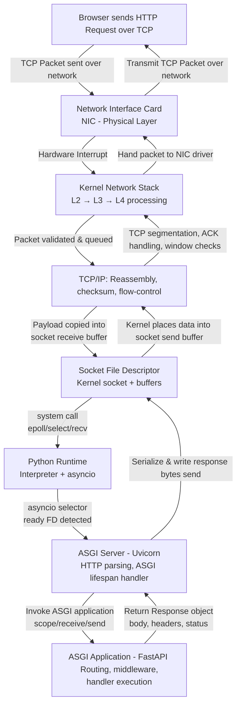
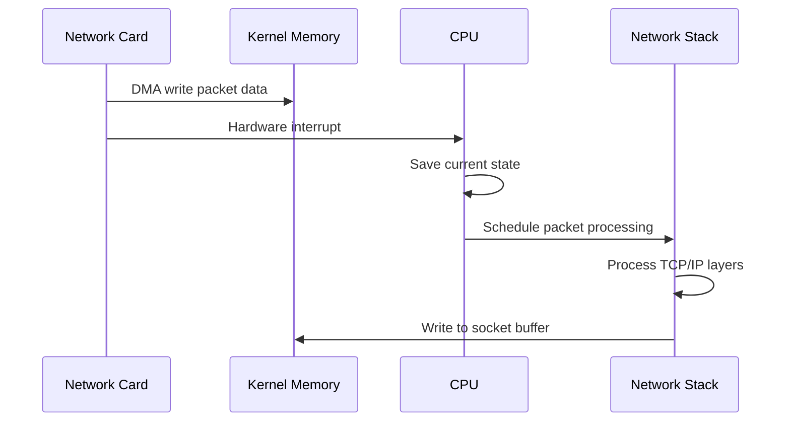
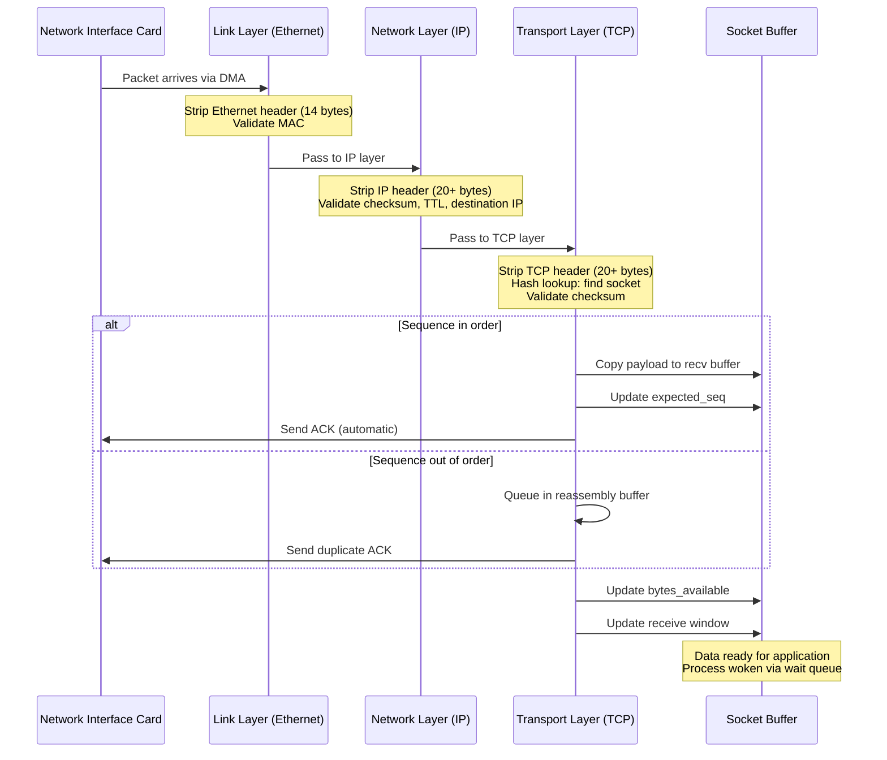
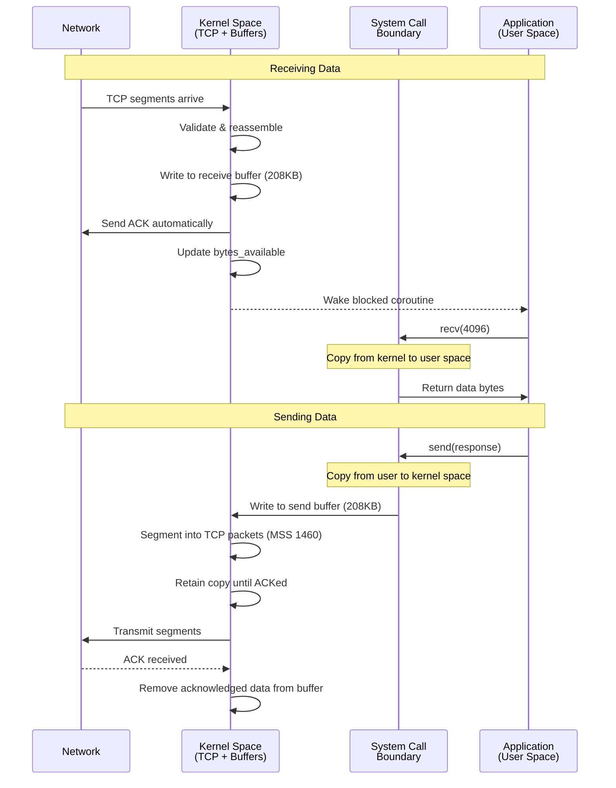
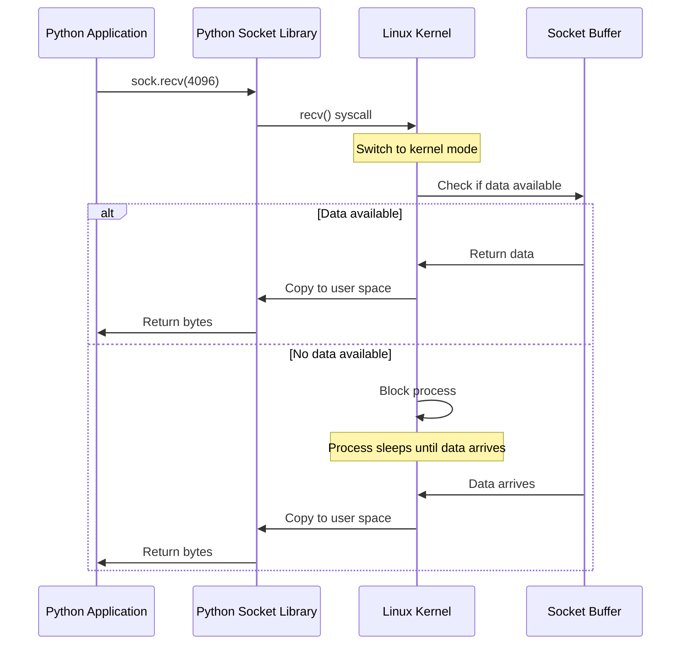
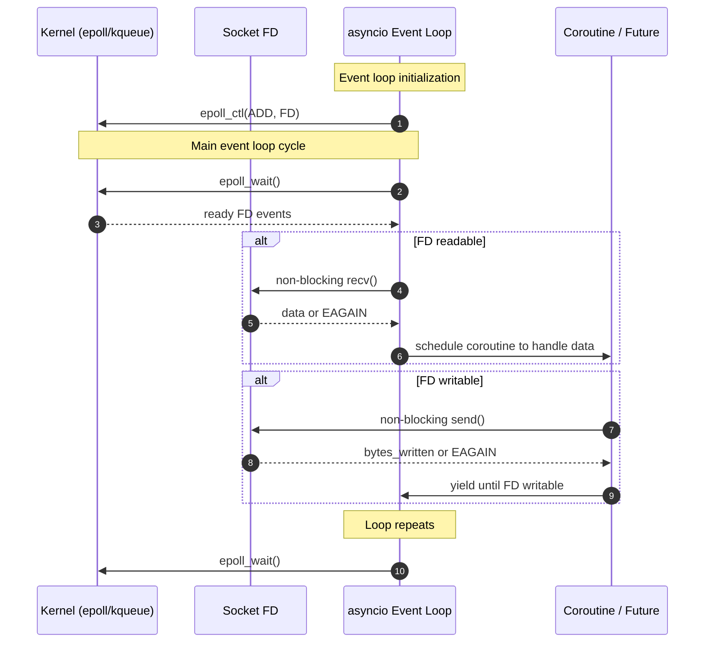
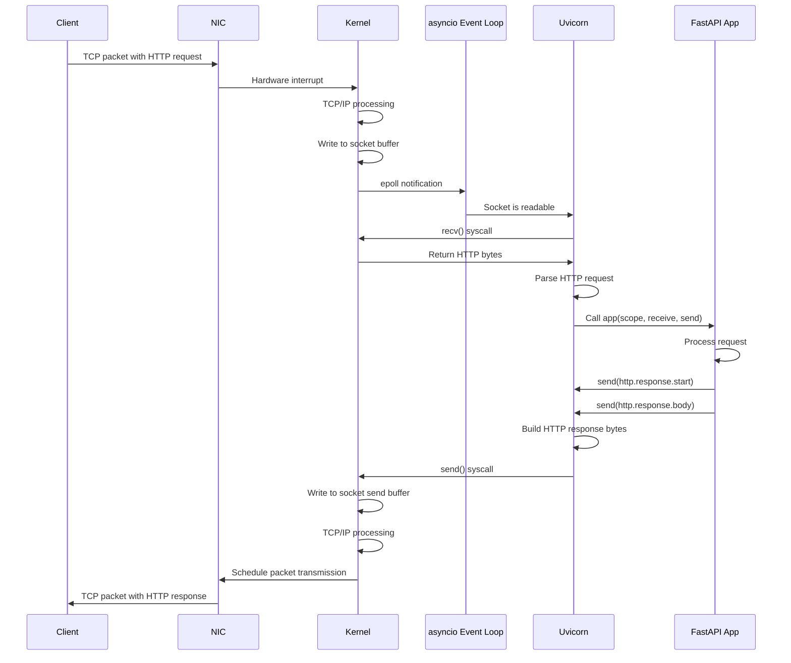
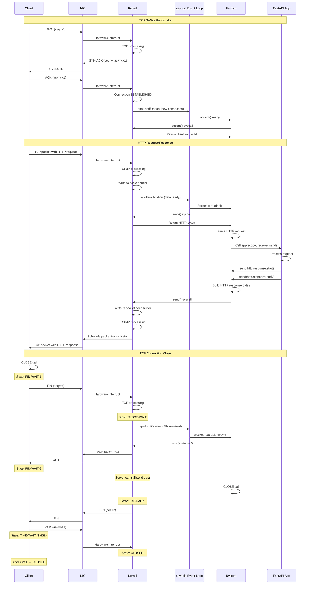

When you type a URL into your browser and hit enter, an extraordinary journey begins. Within milliseconds, your request traverses network cables, gets processed by operating system kernels, flows through Python runtimes, and eventually produces the response you see on screen. This journey is so fast and seamless that we rarely stop to think about the complex choreography happening beneath the surface.

Today, we're going to follow an HTTP request from the moment it arrives at your server's network interface all the way through to the response being sent back. We'll dive deep into kernel space, explore how sockets bridge the OS and application worlds, and see how ASGI(Asynchronous Server Gateway Interface) orchestrates the whole process.

By the end of this post, you'll understand exactly what happens when someone makes a request to your FastAPI application, and why ASGI is designed the way it is.

## The Big Picture

Before we dive into details, let's visualize the complete journey from a high level:




This diagram shows the complete path, but it barely scratches the surface. Let's explore each layer in detail.

## Layer 1: The Kernel Receives Data

### Network Interface and Interrupts

When data arrives at your server, the first component to know about it isn't your Python application or even the operating system's high-level network code. It's the Network Interface Card (NIC) hardware itself.

Here's what happens:

1. **Packet Arrival**: The NIC receives electrical signals (or light pulses for fiber) representing your HTTP request
2. **DMA Transfer**: The NIC uses Direct Memory Access to write the packet data directly into a pre-allocated kernel memory buffer
3. **Hardware Interrupt**: The NIC triggers a hardware interrupt to notify the CPU that data has arrived
4. **Interrupt Handler**: The kernel's interrupt handler is invoked, which schedules the network stack to process this data

This all happens in microseconds, and it's happening for potentially thousands of packets per second on a busy server.



### TCP/IP Stack Processing

Once the interrupt handler schedules packet processing, the kernel's network stack processes the packet through multiple protocol layers. This happens entirely in kernel space.

1. **Ethernet Layer**: Strips off the Ethernet frame, validates the destination MAC address
2. **IP Layer**: Validates IP header, checks destination IP, handles fragmentation if needed
3. **TCP Layer**: This is where the real work happens. The kernel:
   - Validates checksum: Ensures data integrity
   - Looks up connection: Uses (src_ip, src_port, dst_ip, dst_port) to find the socket
   - Checks sequence numbers: Handles out-of-order packets and duplicates
   - Updates state machine: Manages TCP states (ESTABLISHED, FIN_WAIT, etc.)
   - Performs flow control: Adjusts receive window based on buffer availability
   - Sends ACK: Acknowledges received data automatically
4. **Delivering to the socket:** Once the kernel identifies the destination socket, it:
   - Copies payload data into the socket's receive buffer
   - Updates buffer pointers and available byte count
   - Wakes any process/coroutine waiting on this socket (via the wait queue)

Let's visualize the journey:



The entire journey from NIC interrupt to socket buffer typically takes 10-100 microseconds on modern hardware. This processing happens for every single packet, which is why kernel optimization is crucial for high-performance networking.

### Socket Buffers: The Kernel-Userspace Bridge

Once the kernel identifies which socket the packet belongs to using the connection's four-tuple `source IP:port, dest IP:port`, it writes the data into that socket's **receive buffer**, a ring buffer allocated in kernel memory. This buffer is the critical interface between kernel space and user space.

Each socket maintains two buffers:

```c
// Kernel maintains these internally (simplified representation)
struct socket_buffers {
    char recv_buffer[SO_RCVBUF];  // Default: 208KB on Linux
    char send_buffer[SO_SNDBUF];  // Default: 208KB on Linux
    size_t recv_bytes_available;
    size_t send_bytes_used;
    wait_queue_head_t wait_queue; // Processes waiting on this socket
};
```

When TCP segments arrive, the kernel:
1. **Validates** sequence numbers and checksums
2. **Reassembles** out-of-order segments using sequence numbers
3. **Writes** data to the receive buffer
4. **Sends ACK** back to sender (automatic)
5. **Wakes** any process/coroutine blocked on this socket

The receive buffer size determines TCP's **receive window**—how much unacknowledged data the sender can transmit. If your application doesn't read fast enough and the buffer fills, the kernel advertises a zero window, throttling the sender.

For sending, when you call `send()`, data is copied from user space to the kernel's send buffer. The kernel then:
1. **Segments** data into TCP packets (Maximum Segment Size typically 1460 bytes)
2. **Transmits** segments with sequence numbers
3. **Retains** copies until ACKed (for potential retransmission)
4. **Removes** acknowledged data from buffer

You can inspect and tune buffer sizes:

```python
import socket

sock = socket.socket()
# Check current sizes
recv_buf = sock.getsockopt(socket.SOL_SOCKET, socket.SO_RCVBUF)
send_buf = sock.getsockopt(socket.SOL_SOCKET, socket.SO_SNDBUF)

# Increase for high-bandwidth connections
sock.setsockopt(socket.SOL_SOCKET, socket.SO_RCVBUF, 1048576)  # 1MB
sock.setsockopt(socket.SOL_SOCKET, socket.SO_SNDBUF, 1048576)
```

These buffers decouple application read/write speed from network speed, enabling efficient pipelining and flow control—essential for TCP's reliability guarantees. Let's take a look at the full picture:




## Layer 2: System Calls and File Descriptors

### The Socket File Descriptor

In Unix-like systems, the philosophy is "everything is a file"—including network sockets. When your application creates a socket, the kernel returns a **file descriptor**: a small non-negative integer that serves as an index into the process's file descriptor table.

```python
import socket

sock = socket.socket(socket.AF_INET, socket.SOCK_STREAM)
fd = sock.fileno()  # Returns an integer like 3, 4, 5, etc.
print(f"Socket file descriptor: {fd}")
```

**What the file descriptor represents:**

The kernel maintains a per-process table mapping file descriptors to kernel data structures. For sockets, this points to a `struct socket` containing:
- Socket buffers (send/receive)
- Connection state (ESTABLISHED, CLOSE_WAIT, etc.)
- Peer address (IP:port)
- Protocol-specific data (TCP sequence numbers, window size)
- File operations table (read, write, close functions)

**Why file descriptors matter:**

Every socket operation requires passing this file descriptor to the kernel:

```python
import os

# All these operations use the file descriptor internally
data = sock.recv(4096)        # → recv(fd, buffer, 4096)
sock.send(b"data")            # → send(fd, "data", 4)
sock.close()                  # → close(fd)

# You can even use low-level os functions
os.read(fd, 4096)             # Works! Treats socket like a file
os.write(fd, b"data")         # Also works!
```

**File descriptor limits:**

Each process has limits on open file descriptors (typically 1024 by default, configurable up to system limits). This matters for servers handling thousands of connections:

```bash
# Check current limits
ulimit -n  # Soft limit: 1024

# Increase for production servers
ulimit -n 65536
```

When you run out of file descriptors, `accept()` fails with "Too many open files"—a common production issue. ASGI servers handle this by configuring appropriate limits and connection pooling.

### System Calls: Crossing the Boundary

System calls are the mechanism for transitioning from user space (where your Python code runs) to kernel space (where the OS manages hardware and resources). This transition is expensive compared to normal function calls. It involves context switching, privilege level changes, and potentially copying data.

**What happens during a system call:**

```python
import socket

sock = socket.socket(socket.AF_INET, socket.SOCK_STREAM)
```

This innocent-looking Python call triggers:
1. Python → C library wrapper
2. C library → software interrupt (syscall instruction)
3. CPU switches to kernel mode
4. Kernel validates parameters, performs operation
5. CPU switches back to user mode
6. Return value propagated back to Python

Here are the key system calls involved in our HTTP request journey:

```python
import socket

# socket() - Create socket structure in kernel
sock = socket.socket(socket.AF_INET, socket.SOCK_STREAM)

# bind() - Associate socket with address
sock.bind(('0.0.0.0', 8000))

# listen() - Mark socket as passive, create accept queue  
sock.listen(128)

# accept() - Retrieve connection from queue (blocks if empty)
client, addr = sock.accept()

# recv() - Copy data from kernel buffer to user space
data = client.recv(4096)

# send() - Copy data from user space to kernel buffer
client.send(b"HTTP/1.1 200 OK\r\n\r\n")

# close() - Release socket resources
client.close()
```

Let's look at what happens during a `recv()` call:



### Blocking vs Non-Blocking Sockets

Traditional socket programming is **blocking**. When you call `recv()` and there's no data available, your process goes to sleep until data arrives. This is fine for simple applications, but it's disastrous for servers that need to handle thousands of concurrent connections.

```python
import socket

# Blocking socket (default)
sock = socket.socket()
sock.connect(('example.com', 80))
data = sock.recv(4096)  # This BLOCKS until data arrives
print(data)
```

To handle multiple connections, you have three main options:

1. **Multi-threading**: One thread per connection (expensive, doesn't scale to thousands)
2. **Multi-processing**: One process per connection (even more expensive)
3. **Non-blocking I/O with event loops**: Handle many connections in one thread (efficient, scalable)

ASGI is built on non-blocking sockets and uses an event loop to efficiently multiplex between many connections.

```python
import socket
import select

# Non-blocking socket
sock = socket.socket()
sock.setblocking(False)  # This is the key!

try:
    sock.connect(('example.com', 80))
except BlockingIOError:
    pass  # Connect is in progress

# Use select/epoll to wait for socket to be ready
select.select([sock], [sock], [], 5.0)
# Now socket is ready for I/O
```

## Layer 3: The Event Loop and I/O Multiplexing

### The Problem with Blocking I/O

Imagine a web server handling 10,000 concurrent connections. With blocking I/O, you'd need 10,000 threads or processes. Each thread consumes memory (typically 1-8 MB of stack space), and context switching between thousands of threads destroys CPU cache efficiency.

The solution is **I/O multiplexing**: using a single thread to monitor many file descriptors and only processing them when they're ready.

### Enter epoll/kqueue/select

Operating systems provide system calls for efficient I/O multiplexing:

- **select**: The oldest, works on all platforms, limited to ~1024 file descriptors
- **poll**: Similar to select but no hard limit on file descriptors
- **epoll** (Linux): Highly efficient (uses a red–black tree), O(1) performance for ready events
- **kqueue** (BSD/macOS): Similar to epoll

Python's `asyncio` uses the most efficient mechanism available on your platform. On Linux, that's `epoll`.

```python
import select
import socket

# Create a listening socket
server = socket.socket()
server.setblocking(False)
server.bind(('0.0.0.0', 8000))
server.listen(128)

# Create epoll object
epoll = select.poll()
epoll.register(server.fileno(), select.POLLIN)

# Event loop
connections = {}
while True:
    # Wait for events (this is a blocking syscall, but efficient!)
    events = epoll.poll()
    
    for fd, event in events:
        if fd == server.fileno():
            # New connection
            client, addr = server.accept()
            client.setblocking(False)
            epoll.register(client.fileno(), select.POLLIN)
            connections[client.fileno()] = client
        else:
            # Data on existing connection
            client = connections[fd]
            data = client.recv(4096)
            print(data.decode())
            client.send(b"HTTP/1.1 200 OK\r\n\r\nHello")
            epoll.unregister(fd)
            client.close()
            del connections[fd]
```

This pattern register file descriptors with epoll, wait for events, handle ready sockets is the foundation of all async Python frameworks.

### Python's asyncio Event Loop

Python's `asyncio` wraps this low-level epoll/kqueue machinery in a high-level API with coroutines, tasks, and futures. Here's a simplified view of what the event loop does:



Here's what this looks like in actual asyncio code:

```python
import asyncio

async def handle_client(reader, writer):
    """Handle a single client connection"""
    # reader.read() doesn't block the thread!
    # It yields control back to the event loop
    data = await reader.read(4096)
    
    # Process request
    response = b"HTTP/1.1 200 OK\r\n\r\nHello World"
    
    # writer.write() is synchronous, but drain() waits for the write to complete
    writer.write(response)
    await writer.drain()
    
    writer.close()
    await writer.wait_closed()

async def main():
    # Start server
    server = await asyncio.start_server(
        handle_client, 
        '0.0.0.0', 
        8000
    )
    
    async with server:
        await server.serve_forever()

# Run the event loop
asyncio.run(main())
```

When `await reader.read(4096)` is called:
1. The `asyncio` event loop checks if data is available in the kernel socket buffer (`epoll_ctl`)
2. If not available, it registers interest in this socket with epoll (`epoll_wait`)
3. The coroutine is suspended, event loop continues with other tasks
4. When data arrives, kernel notifies epoll, event loop resumes the coroutine (performs `recv()`)
5. Data is read from kernel buffer to user space (via `recv()`) and returned


When `writer.write(response)` is called:
1. The asyncio event loop checks if the socket is writable (if the kernel send buffer has space)
2. If the send buffer is full, the event loop registers interest in `writable` events using `epoll_wait`.
3. The coroutine is suspended, and the event loop continues running other tasks
4. When kernel buffer becomes available, kernel notifies epoll and event loop resumes the suspended coroutine (performs `send()`)
5. Data is copied from user space into the kernel buffer (via `send()`) and returns once the write is accepted


## Layer 4: ASGI Protocol

### Why ASGI Exists

We've now covered how data gets from the network card to the Python event loop. But there's still a gap: how does the event loop pass HTTP requests to your web application (FastAPI)? This is where ASGI comes in. ASGI is a **specification**, an agreed-upon interface between web servers (like Uvicorn) and web applications (like FastAPI).

Before ASGI, we had WSGI (Web Server Gateway Interface), which worked perfectly for synchronous Python. But WSGI has a fundamental limitation: it's synchronous and blocking. Every request blocks a worker thread. ASGI solves this by defining an async interface that allows servers and applications to communicate using coroutines.

### The ASGI Interface

At its core, ASGI defines two things:

1. **Application**: A coroutine that receives events and can send events back
2. **Message format**: Standardized dictionaries for communication

Here's the signature of an ASGI application:

```python
async def application(scope, receive, send):
    """
    scope: dict - Information about the connection (HTTP or WebSocket)
    receive: coroutine - Receive messages from the server
    send: coroutine - Send messages to the server
    """
    pass
```

Let's build a simple ASGI application to see how this works:

```python
async def hello_world_app(scope, receive, send):
    """Simplest possible ASGI application"""
    
    # scope contains connection metadata
    if scope['type'] == 'http':
        # Wait for the HTTP request body (even if empty)
        await receive()
        
        # Send response start (status and headers)
        await send({
            'type': 'http.response.start',
            'status': 200,
            'headers': [
                [b'content-type', b'text/plain'],
            ],
        })
        
        # Send response body
        await send({
            'type': 'http.response.body',
            'body': b'Hello, World!',
        })
```

This looks simple, but notice what's happening:
- The application is completely async
- It communicates with the server through the `receive` and `send` coroutines
- Messages are just dictionaries with standardized keys

### ASGI Server: Bridging Sockets and Applications

An ASGI server like Uvicorn sits between the socket layer and your application. Its job is to:

1. Accept connections from clients
2. Parse HTTP requests from raw bytes
3. Convert them to ASGI messages
4. Call your application
5. Convert ASGI response messages back to HTTP bytes
6. Send them back through the socket

Here's a simplified view of what Uvicorn does (this is a fully working code, you may run and test it yourself):

```python
import asyncio
import httptools


class ASGIServer:
    def __init__(self, app):
        self.app = app

    async def handle_connection(self, reader, writer):
        parser = httptools.HttpRequestParser(self)
        self.parser = parser  # attached for callbacks
        self.writer = writer
        self.reader = reader
        self.headers = []
        self.body = b""
        self.url = None
        self.method = None
        self.complete = False
        self.upgrade = False

        try:
            while not self.complete:
                data = await reader.read(65536)
                if not data:
                    return  # client disconnected
                parser.feed_data(data)  # may raise HttpParserError → caught below

            # After on_message_complete(), we have a full request → run ASGI app
            await self._run_app()

        except httptools.HttpParserError:
            self._write_response(b"HTTP/1.1 400 Bad Request\r\n\r\n")
        except Exception as e:
            print("Error:", e)
            self._write_response(b"HTTP/1.1 500 Internal Error\r\n\r\n")
        finally:
            writer.close()
            await writer.wait_closed()

    # ─────── httptools callbacks ───────
    def on_url(self, url: bytes):
        self.url = url
        parsed = httptools.parse_url(url)
        self.path = parsed.path.decode() if parsed.path else "/"
        self.query_string = parsed.query or b""

    def on_header(self, name: bytes, value: bytes):
        self.headers.append((name.lower(), value))

    def on_headers_complete(self):
        self.method = self.parser.get_method().decode()

    def on_body(self, body: bytes):
        self.body += body

    def on_message_complete(self):
        self.complete = True

    # ─────── Helper to send raw HTTP response (used only on errors) ───────
    def _write_response(self, data: bytes):
        try:
            self.writer.write(data)
            asyncio.create_task(self.writer.drain())
        except:
            pass

    # ─────── Run the actual ASGI application ───────
    async def _run_app(self):
        scope = {
            "type": "http",
            "asgi": {"version": "3.0", "spec_version": "2.3"},
            "http_version": "1.1",
            "method": self.method,
            "scheme": "http",
            "path": self.path,
            "raw_path": self.url,
            "query_string": self.query_string,
            "headers": self.headers,
            "server": ("127.0.0.1", 8000),
            "client": self.writer.get_extra_info("peername"),
        }

        # receive() – streams body if app asks for it
        async def receive():
            if self.body:
                body, self.body = self.body, b""
                return {"type": "http.request", "body": body, "more_body": False}
            return {"type": "http.request", "body": b"", "more_body": False}

        # send() – converts ASGI messages → raw HTTP via httptools
        async def send(message):
            if message["type"] == "http.response.start":
                status = message["status"]
                headers = message.get("headers", [])

                # Build response line + headers
                out = f"HTTP/1.1 {status} OK\r\n".encode()
                for name, value in headers:
                    out += name + b": " + value + b"\r\n"
                out += b"\r\n"

                self.writer.write(out)
                await self.writer.drain()

            elif message["type"] == "http.response.body":
                body = message.get("body", b"")
                if body:
                    self.writer.write(body)
                    await self.writer.drain()

        # Run the ASGI app
        await self.app(scope, receive, send)

    async def serve(self, host="127.0.0.1", port=8000):
        server = await asyncio.start_server(self.handle_connection, host, port)

        print(f"ASGI server running on http://{host}:{port}")
        async with server:
            await server.serve_forever()


# —————————— Simple application ——————————
async def app(scope, receive, send):

    await send(
        {
            "type": "http.response.start",
            "status": 200,
            "headers": [(b"content-type", b"text/plain")],
        }
    )
    await send({"type": "http.response.body", "body": b"Hello from ASGI server!\n"})


# —————————— Run the server ——————————
if __name__ == "__main__":
    server = ASGIServer(app)
    try:
        asyncio.run(server.serve("127.0.0.1", 8000))
    except KeyboardInterrupt:
        print("\nServer stopped")
```

### The Complete Flow

Let's trace a complete HTTP request through all layers:



Wait! Did we miss something? What about TCP handshake? Well, let's take a look at that briefly. 

#### Three-Way Handshake

When a client connects, the kernel automatically completes a three-step handshake:

1. **Client → Server (SYN)**: "I want to connect, my sequence number is x"
2. **Server → Client (SYN-ACK)**: "Acknowledged, my sequence number is y"
3. **Client → Server (ACK)**: "Acknowledged, connection established"

Your application doesn't see these packets—the kernel handles everything. When you call `accept()`, you get a fully-established connection:

```python
client, addr = server.accept()  # Returns after handshake completes
```

#### Data Transfer

Now HTTP data flows bidirectionally. Each `send()` and `recv()` moves data between your application and the kernel's socket buffers:

```python
request = client.recv(4096)      # Read HTTP request
client.send(b"HTTP/1.1 200 OK")  # Send HTTP response
```

The kernel handles TCP's reliability—retransmitting lost packets, reordering segments, and managing flow control.

#### Four-Way Teardown

Closing requires four steps because TCP is full-duplex (two independent pipes):

1. **Client sends FIN**: "I'm done sending"
2. **Server sends ACK**: "Got it"
3. **Server sends FIN**: "I'm done too"
4. **Client sends ACK**: "Got it, goodbye"

```python
client.close()  # Initiates graceful shutdown
```

This graceful close ensures no data is lost. After closing, the port enters TIME_WAIT state (60-120 seconds) to handle any delayed packets.

Here's the full trace of a complete HTTP request through all layers:




## Conclusion

We've journeyed from hardware interrupts to high-level web frameworks, covering:

1. **Kernel layer**: NIC interrupts, TCP/IP stack, socket buffers
2. **System calls**: The boundary between user and kernel space
3. **Event loops**: Efficient I/O multiplexing with epoll
4. **ASGI protocol**: The standard interface connecting servers and applications


The key insight is that ASGI isn't just an arbitrary API, it's carefully designed to map efficiently onto the underlying operating system primitives. Every design decision makes sense when you understand the full stack:

- **Why async?** Because non-blocking sockets + epoll scale to thousands of connections
- **Why coroutines?** Because they provide async semantics without callback hell
- **Why the scope/receive/send pattern?** Because it maps cleanly to the HTTP message model while supporting streaming

When you understand this full picture, you can write faster, more efficient web applications, debug problems more effectively, and appreciate the elegant engineering that makes modern Python web frameworks possible.

In future posts, we'll use this knowledge to build our own ASGI server from scratch, implementing every layer we've discussed today. But for now, the next time you write `@app.get("/")`, you'll know the incredible journey that happens when someone visits that endpoint.
